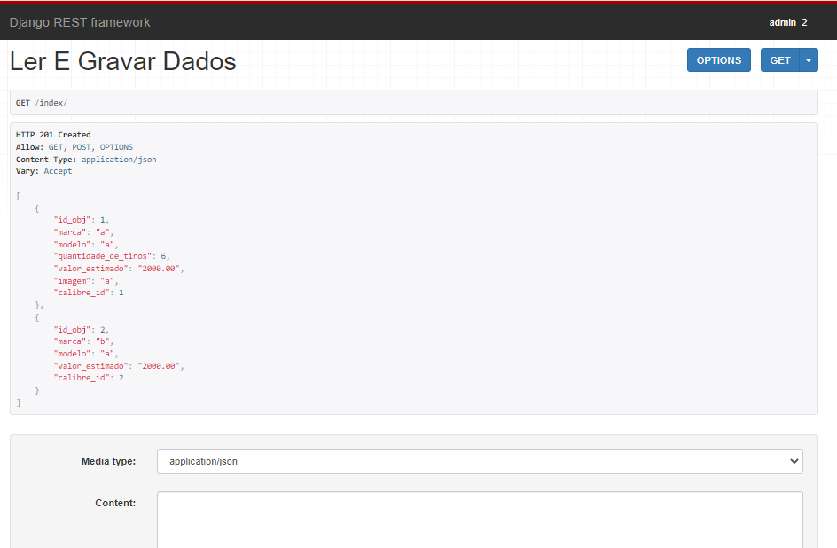

# atividade_vaga_python

Resolução da atividade referente à vaga de Desenvolvedor Python Jr por Larissa Queiroz.

## Tecnologias usadas
* Python (3.10.1)
* Django
* Django REST Framework

## Execução
1. Instale as libs necessárias
```
pip install -r requirements.txt
```

2. Execute e abra o endereço mostrado na resposta em uma IDE de sua preferência.

3. Acesso ao superuser
login: admin_2
senha: admin

## Resolução e dificuldades enfrentadas

Não consegui atingir a solução requisitada pois tive dificuldade em estabelecer os relacionamentos do banco. Criei o projeto e os models, analisei o banco usando o software DBeaver e o modelo gerado a partir do banco do meu projeto estava igual ao fornecido (imagem acima). 
\
O GET está funcional mas só consegui fazer o POST duas vezes pois sempre dá o erro "IntegrityError at /index/ UNIQUE constraint failed: app_municao.id_obj_id" e o mesmo para o id da classe arma. Acredito que tem a ver com o OneToOneField. Pesquisei e tentei bastante mas não consegui resolver a tempo da entrega deste desafio.
\
Uma dúvida que tive foi sobre a relação entre Objeto e Arma/Munição. Não entendi porquê devem ter várias armas/munições pra 1 objeto sendo que, pra mim, cada arma/objeto representaria um objeto.

## Considerações finais
Fazer esse desafio foi muito interessante pra mim pois aprendi muito sobre banco de dados, algo que não me aprofundei tanto antes. Além disso, me familiarizei mais com o Django que é o ponto que estou focando nos meus estudos atualmente, fazendo projetos pessoais e cursos. Agradeço a oportunidade dada ao me propor o desafio.